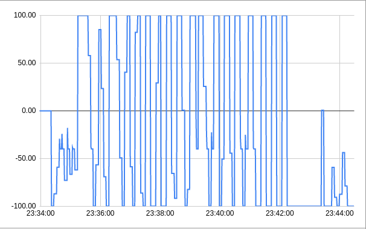
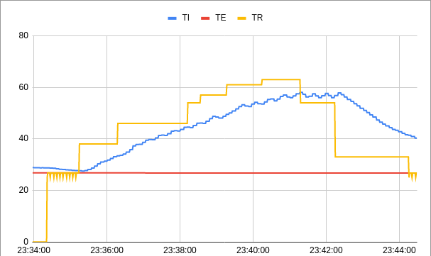

# FSE - Trabalho 1
Repositório para o trabalho 1 de Fundamentos de Sistemas Embarcados. Enunciado do trabalho: https://gitlab.com/fse_fga/trabalhos-2021_2/trabalho-1-2021-2.

## Compilação e execução
Na pasta raiz, utilize make para compilar e make run para executar.

## Uso
No início serão solicitados os valores para as constantes do PID (Kp, Ki, Kd) em seguida o sistema poderá ser controlado de 2 formas:
- Terminal - comandos indicados em execução;
- Dashboard - através dos botões.

## Experimentos

### Temperaturas

Potenciômetro

Curvas

### Atuadores
Valores acima de 0 indicam que o resistor está ativo e abaixo que a ventoinha está ativa, porém valores entre -40 e 0 são convertidos em -40 (apenas no PWM).

Potenciômetro

Curvas
